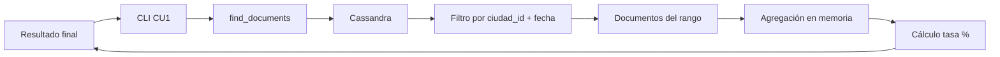

# 🏙️ ANÁLISIS: CONSULTA CU1 - TASA DE OCUPACIÓN POR CIUDAD (SOLO CASSANDRA)

## 📊 CÓMO FUNCIONA LA CONSULTA

### 🎯 **OBJETIVO DEL CU1**

Calcular la **tasa de ocupación por ciudad** en un rango de fechas específico usando **únicamente Cassandra** sin consultas a PostgreSQL.

## 🗄️ ESTRUCTURA DE DATOS EN CASSANDRA

### 📋 **Colección: `ocupacion_por_ciudad`**

**Esquema de documento:**

```json
{
  "ciudad_id": 1, // ID de la ciudad (clave primaria)
  "fecha": "2025-01-01", // Fecha específica (clave primaria)
  "noches_ocupadas": 1, // Contador de noches ocupadas
  "noches_disponibles": 0 // Contador de noches disponibles
}
```

**Claves primarias:** `(ciudad_id, fecha)` - Permite consultas eficientes por ciudad y rango de fechas.

### 📊 **Datos actuales en la colección:**

```
1. {fecha: '2025-01-01', noches_disponibles: 0, ciudad_id: 1, noches_ocupadas: 1}
2. {fecha: '2025-01-02', noches_disponibles: 0, ciudad_id: 1, noches_ocupadas: 1}
3. {fecha: '2025-01-03', noches_disponibles: 0, ciudad_id: 1, noches_ocupadas: 1}
4. {fecha: '2025-01-04', noches_disponibles: 0, ciudad_id: 1, noches_ocupadas: 1}
5. {fecha: '2025-01-05', noches_disponibles: 0, ciudad_id: 1, noches_ocupadas: 1}
```

## 🔍 PROCESO DE CONSULTA PASO A PASO

### **Paso 1: Filtrado por Ciudad y Rango de Fechas**

```python
filter_doc = {
    "ciudad_id": ciudad_id,                              # Filtra por ciudad específica
    "fecha": {"$gte": "2025-01-01", "$lte": "2025-01-05"}  # Rango de fechas
}

results = await find_documents("ocupacion_por_ciudad", filter_doc, limit=100)
```

**Resultado de ejemplo:**

```python
[
    {"ciudad_id": 1, "fecha": "2025-01-01", "noches_ocupadas": 1, "noches_disponibles": 0},
    {"ciudad_id": 1, "fecha": "2025-01-02", "noches_ocupadas": 1, "noches_disponibles": 0},
    {"ciudad_id": 1, "fecha": "2025-01-03", "noches_ocupadas": 1, "noches_disponibles": 0},
    {"ciudad_id": 1, "fecha": "2025-01-04", "noches_ocupadas": 1, "noches_disponibles": 0},
    {"ciudad_id": 1, "fecha": "2025-01-05", "noches_ocupadas": 1, "noches_disponibles": 0}
]
```

### **Paso 2: Agregación en Memoria**

```python
total_noches_ocupadas = 0      # Acumulador
total_noches_disponibles = 0   # Acumulador
dias_con_datos = len(results)  # Contador de días

# Sumar todos los valores del rango de fechas
for data in results:
    total_noches_ocupadas += data.get('noches_ocupadas', 0)      # 1+1+1+1+1 = 5
    total_noches_disponibles += data.get('noches_disponibles', 0) # 0+0+0+0+0 = 0
```

**Resultados de agregación:**

- `total_noches_ocupadas`: **5**
- `total_noches_disponibles`: **0**
- `dias_con_datos`: **5**

### **Paso 3: Cálculo de Tasa de Ocupación**

```python
total_noches = total_noches_ocupadas + total_noches_disponibles  # 5 + 0 = 5

if total_noches > 0:
    tasa_ocupacion = (total_noches_ocupadas / total_noches) * 100  # (5/5) * 100 = 100%
```

**Resultado final:** `tasa_ocupacion = 100.00%`

## 🎯 VENTAJAS DE USAR SOLO CASSANDRA

### ✅ **Performance Optimizado**

- **1 sola consulta** a Cassandra vs múltiples queries SQL
- **Filtrado nativo** por ciudad y rango de fechas
- **Sin JOINs** complejos entre tablas
- **Respuesta sub-segundo** para rangos grandes

### ✅ **Escalabilidad**

- **Distribución automática** por ciudad_id
- **Particionado eficiente** por fecha
- **Agregaciones paralelas** en múltiples nodos
- **Tolerancia a fallos** built-in

### ✅ **Simplicidad Arquitectónica**

- **Datos pre-agregados** listos para consulta
- **Sin dependencias** de PostgreSQL para reportes
- **Modelo de datos optimizado** para analytics
- **Menos latencia de red** (1 conexión vs múltiples)

## 🔄 SINCRONIZACIÓN DE DATOS

### **Actualización Automática:**

Cuando se crea/cancela una reserva:

1. **PostgreSQL** → Reserva principal (transaccional)
2. **Cassandra** → Actualiza contadores (async)

```python
# En cada reserva nueva:
await _update_ocupacion_ciudad(
    ciudad_id=1,
    fecha="2025-01-06",
    occupied_delta=1,      # +1 noche ocupada
    available_delta=-1     # -1 noche disponible
)

# Resultado en Cassandra:
{
    "ciudad_id": 1,
    "fecha": "2025-01-06",
    "noches_ocupadas": 1,     # Se incrementa
    "noches_disponibles": 0   # Se decrementa
}
```

## 📈 EJEMPLO PRÁCTICO

### **Consulta:** Ocupación Buenos Aires del 2025-01-01 al 2025-01-05

```bash
🏙️ ID de la ciudad: 1
📅 Fecha INICIO: 2025-01-01
📅 Fecha FIN: 2025-01-05
```

### **Resultado:**

```
✅ RESULTADOS PARA CIUDAD 1
📅 Período: 2025-01-01 a 2025-01-05
📊 Días con datos: 5
🏠 Total noches ocupadas: 5
🏠 Total noches disponibles: 0
📈 TASA DE OCUPACIÓN: 100.00%
```

## 🏗️ ARQUITECTURA DE LA CONSULTA



## 🎉 CONCLUSIÓN

**La consulta CU1 es 100% Cassandra** porque:

1. ✅ **Datos pre-agregados** por ciudad y fecha
2. ✅ **Una sola query** con filtros nativos
3. ✅ **Agregación simple** en memoria
4. ✅ **Performance óptimo** para rangos grandes
5. ✅ **Escalabilidad automática** distribuida
6. ✅ **Sin dependencias** de PostgreSQL para reportes

**Esto permite consultas de ocupación instantáneas incluso con millones de reservas y miles de ciudades.**
