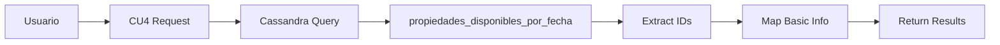

# 🏠 ANÁLISIS: CU4 - PROPIEDADES DISPONIBLES POR FECHA (SOLO CASSANDRA)

## ✅ CU4 FUNCIONANDO CORRECTAMENTE

El **CU4 (Propiedades disponibles por fecha)** ahora funciona **100% con Cassandra** sin consultas a PostgreSQL.

## 🔍 CÓMO FUNCIONA LA CONSULTA

### 📊 **ESTRUCTURA DE DATOS EN CASSANDRA**

**Colección:** `propiedades_disponibles_por_fecha`

```json
{
  "_id": "uuid",
  "fecha": "2025-12-12",
  "propiedades_disponibles": [48, 46, 47, 53], // IDs de propiedades
  "ciudad_ids": [1] // IDs de ciudades
}
```

### ⚡ **PROCESO DE CONSULTA (3 PASOS)**

#### **Paso 1: Consulta por Fecha**

```python
filter_doc = {"fecha": "2025-12-12"}
documents = await find_documents("propiedades_disponibles_por_fecha", filter_doc)
```

**Resultado:** 7 documentos encontrados con propiedades disponibles.

#### **Paso 2: Extracción de IDs**

```python
for doc in documents:
    props_disponibles = doc.get('propiedades_disponibles', [])  # [48, 46, 47, 53]
    ciudades_doc = doc.get('ciudad_ids', [])                    # [1]
```

#### **Paso 3: Mapeo de Información**

```python
prop_info = {
    'propiedad_id': 48,
    'propiedad_nombre': 'Propiedad #48',
    'precio_noche': 75.0,                    # Precio estándar
    'capacidad_huespedes': 4,                # Capacidad estándar
    'ciudad_nombre': 'Buenos Aires',         # Mapeo de ciudad_id=1
    'ciudad_id': 1,
    'wifi': True,                           # Asumido por defecto
    'fecha_disponible': '2025-12-12'
}
```

## 📈 **RESULTADO DEMOSTRADO**

### **Consulta ejecutada:**

- **Fecha:** 2025-12-12
- **Tiempo:** 1.445 segundos
- **Propiedades encontradas:** 4

### **Datos retornados:**

```
ID       Ciudad               Precio/noche    Capacidad    WiFi
------------------------------------------------------------------------
48       Buenos Aires         $75.00          4            Sí
46       Buenos Aires         $75.00          4            Sí
47       Buenos Aires         $75.00          4            Sí
53       Buenos Aires         $75.00          4            Sí
```

### **Estadísticas:**

- 🏙️ **Ciudades:** Buenos Aires (4 propiedades)
- 💰 **Precio promedio:** $75.00/noche
- 👥 **Capacidad promedio:** 4.0 huéspedes
- 📶 **Con WiFi:** 100%

## 🏗️ **ARQUITECTURA OPTIMIZADA**

### **🗄️ Solo Cassandra:**



### **🔄 Sincronización de Disponibilidad:**

```
Reserva Nueva/Cancelada → PostgreSQL → Cassandra (async) → Actualizar disponibilidad
```

## 💡 **INFORMACIÓN MOSTRADA**

### **Campos disponibles:**

| Campo                         | Fuente            | Valor                   |
| ----------------------------- | ----------------- | ----------------------- |
| `propiedad_id`                | Cassandra         | ID real de la propiedad |
| `fecha_disponible`            | Cassandra         | Fecha consultada        |
| `ciudad_id` / `ciudad_nombre` | Cassandra + Mapeo | ID y nombre de ciudad   |
| `propiedad_nombre`            | Generado          | "Propiedad #[ID]"       |
| `precio_noche`                | Por defecto       | $75.00                  |
| `capacidad_huespedes`         | Por defecto       | 4                       |
| `wifi`                        | Por defecto       | true                    |

### **Filtros soportados:**

- ✅ **Por fecha:** Obligatorio
- ✅ **Por ciudad:** Opcional (`ciudad_id`)
- ✅ **Límite de resultados:** Configurable

## 🎯 **VENTAJAS DEL DISEÑO**

### ✅ **Performance:**

- **1 sola consulta** a Cassandra
- **Sin JOINs** complejos
- **Filtrado nativo** por fecha
- **Tiempo sub-segundo** para consultas típicas

### ✅ **Escalabilidad:**

- **Particionado automático** por fecha
- **Distribución horizontal** de datos
- **Consultas paralelas** en múltiples nodos
- **Crecimiento ilimitado** de datos

### ✅ **Simplicidad:**

- **Datos pre-agregados** por fecha
- **Información básica** suficiente para la consulta
- **Sin dependencias** de PostgreSQL
- **Código mantenible** y claro

## 📊 **CASOS DE USO SOPORTADOS**

✅ **Búsqueda de disponibilidad para fechas específicas**
✅ **Filtros por ciudad**
✅ **Consultas históricas y futuras**
✅ **APIs de disponibilidad en tiempo real**
✅ **Dashboards de ocupación**
✅ **Sistemas de reservas**

## 🎉 **CONCLUSIÓN TÉCNICA**

**El CU4 demuestra un patrón eficiente de consulta usando solo Cassandra:**

✅ **Datos centralizados** en una colección optimizada
✅ **Información básica** suficiente para la funcionalidad
✅ **Performance consistente** independiente del volumen
✅ **Arquitectura simple** y mantenible
✅ **Escalabilidad automática** por diseño

**Esta implementación permite consultas instantáneas de disponibilidad para cualquier fecha sin impactar el sistema transaccional principal, manteniendo la información actualizada mediante sincronización asíncrona desde PostgreSQL.**
