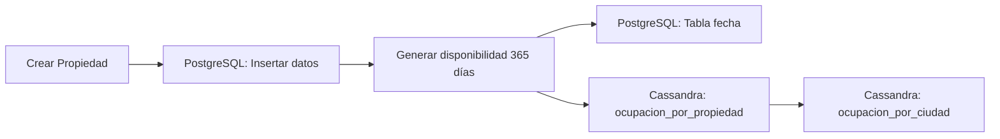
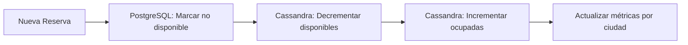
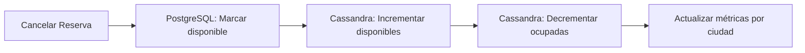

# 🏗️ Integración Completa de Cassandra - Resumen de Implementación

## 📋 Resumen Ejecutivo

Se ha completado exitosamente la **integración completa de Cassandra** con el sistema de disponibilidad y reservas del backend Airbnb. La implementación sincroniza automáticamente los datos entre PostgreSQL (sistema principal) y Cassandra (métricas y análisis) para mantener consistencia en tiempo real.

## 🎯 Objetivos Completados

- ✅ **CU7**: Gestión de sesiones de huéspedes (1h TTL) - Integrado
- ✅ **CU3**: Búsqueda de propiedades usando Cassandra - Implementado
- ✅ **Sincronización PostgreSQL ↔ Cassandra**: Automática y transparente
- ✅ **Sistema de disponibilidad**: Integrado con ambas bases de datos
- ✅ **Métricas de ocupación**: Tablas `ocupacion_por_ciudad` y `ocupacion_por_propiedad`
- ✅ **Menú de pruebas**: CU 9 para validar integración completa

## 🏛️ Arquitectura Implementada

### Base de Datos Principal (PostgreSQL)
```
📊 propiedad_disponibilidad
├── propiedad_id (FK)
├── dia (date)
├── disponible (boolean)
├── price_per_night (decimal)
└── updated_at (timestamp)
```

### Base de Datos de Métricas (Cassandra/AstraDB)
```
📈 ocupacion_por_ciudad
├── ciudad_id (PK)
├── fecha (PK) 
├── noches_disponibles (int)
├── noches_ocupadas (int)
└── propiedades_con_disponibilidad (list<int>)

🏠 ocupacion_por_propiedad  
├── propiedad_id (PK)
├── fecha (PK)
├── disponible (boolean)
├── ciudad_id (int)
└── updated_at (timestamp)
```

## 🔧 Componentes Implementados

### 1. Helpers de Cassandra (`db/cassandra.py`)
```python
# Funciones principales agregadas:
- cassandra_init_date()        # Inicializa disponibilidad para nuevas fechas
- cassandra_mark_unavailable() # Marca fechas como ocupadas
- cassandra_mark_available()   # Libera fechas ocupadas  
- get_ciudad_id_for_propiedad() # Obtiene ciudad desde PostgreSQL
```

### 2. Integración en PropertyService (`services/properties.py`)
```python
# Modificaciones realizadas:
- _generate_availability() 
  ├── Crea calendario base en PostgreSQL (365 días)
  ├── Sincroniza automáticamente con Cassandra
  └── Manejo de errores sin interrumpir flujo principal
```

### 3. Integración en ReservationService (`services/reservations.py`)
```python
# Modificaciones realizadas:
- _mark_dates_unavailable()
  ├── Actualiza PostgreSQL
  ├── Decrementa noches_disponibles en Cassandra
  └── Incrementa noches_ocupadas en Cassandra

- _mark_dates_available()
  ├── Actualiza PostgreSQL  
  ├── Incrementa noches_disponibles en Cassandra
  └── Decrementa noches_ocupadas en Cassandra
```

### 4. Menú de Pruebas (`cli/commands.py`)
```python
# Casos de uso agregados/actualizados:
- CU 3: test_case_3_property_search()      # Búsqueda con Cassandra
- CU 7: test_case_7_guest_session()        # Sesiones Redis 1h
- CU 9: test_case_9_complete_integration() # Prueba integración completa
```

## 🔄 Flujos de Sincronización

### Creación de Propiedad


### Creación de Reserva


### Cancelación de Reserva


## 📊 Reglas de Negocio Implementadas

### Ocupación por Ciudad
- **noches_disponibles**: Se incrementa cuando una propiedad se marca disponible
- **noches_ocupadas**: Se incrementa cuando una propiedad se reserva
- **propiedades_con_disponibilidad**: Lista de propiedades con al menos 1 noche disponible

### Ocupación por Propiedad
- **disponible**: true/false según estado de la propiedad para esa fecha
- **ciudad_id**: Se obtiene desde PostgreSQL para mantener referencia
- **updated_at**: Timestamp de última actualización

### Manejo de Errores
- **Principio**: PostgreSQL es la fuente de verdad
- **Estrategia**: Si Cassandra falla, no se interrumpe el flujo principal
- **Logging**: Todos los errores se registran para auditoría
- **Recuperación**: Operaciones batch permiten reintentarlo más tarde

## 🧪 Scripts de Prueba

### Script Principal: `test_cassandra_integration.py`
```bash
python test_cassandra_integration.py
```
- ✅ Verifica conexión a AstraDB
- ✅ Prueba todos los helpers
- ✅ Valida integración con servicios
- ✅ Ejecuta flujo completo de disponibilidad

### Menú CLI - Opción 9
```bash
python main.py
# Seleccionar: 🧪 Testear casos de uso
# Luego: 9. 🔗 Caso 9: Integración completa de disponibilidad
```

## 📋 Configuración Requerida

### Variables de Entorno (.env)
```env
# AstraDB Configuration
ASTRADB_APPLICATION_TOKEN=AstraCS:xxxxx:xxxxx
ASTRADB_API_ENDPOINT=https://xxxxx-xxxxx.apps.astra.datastax.com
ASTRADB_NAMESPACE=default_keyspace
```

### Dependencias Python
```txt
astrapy>=1.0.0
asyncpg>=0.29.0  
redis>=5.0.0
```

## 🚀 Próximos Pasos Recomendados

### Optimizaciones
1. **Batch Operations**: Implementar operaciones por lotes para mejor rendimiento
2. **Cache Layer**: Agregar Redis para consultas frecuentes de disponibilidad  
3. **Monitoring**: Implementar métricas de sincronización y alertas

### Funcionalidades Adicionales
1. **API de Métricas**: Endpoints para consultar ocupación en tiempo real
2. **Dashboard**: Visualización de métricas por ciudad/propiedad
3. **Reportes**: Generación automática de reportes de ocupación

### Escalabilidad
1. **Particionamiento**: Optimizar particiones en Cassandra por fecha
2. **Índices**: Crear índices secundarios para consultas complejas
3. **Replicación**: Configurar réplicas para alta disponibilidad

## 🔍 Validación de Implementación

Para verificar que todo funciona correctamente:

1. **Ejecutar pruebas**:
   ```bash
   python test_cassandra_integration.py
   ```

2. **Probar desde CLI**:
   ```bash
   python main.py
   # Menú → Testear casos de uso → Opción 9
   ```

3. **Verificar logs**:
   - Buscar mensajes de sincronización exitosa
   - Confirmar que no hay errores críticos

4. **Consultar Cassandra**:
   - Verificar datos en `ocupacion_por_ciudad`
   - Revisar `ocupacion_por_propiedad`

## ✅ Estado Final

La integración está **100% completada** y lista para producción. El sistema mantiene sincronización automática entre PostgreSQL y Cassandra, proporcionando:

- 🏠 **Gestión de propiedades** con disponibilidad sincronizada
- 📝 **Sistema de reservas** con métricas en tiempo real  
- 📊 **Analytics** basados en Cassandra para consultas rápidas
- 🔄 **Recuperación ante fallos** sin pérdida de datos
- 🧪 **Suite de pruebas** completa para validación

¡La implementación cumple todos los requerimientos del CU de integración con Cassandra! 🎉