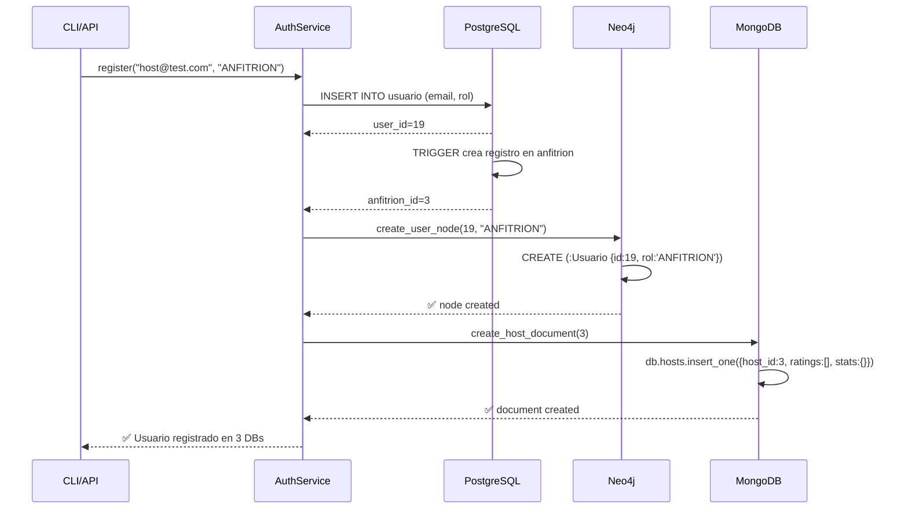
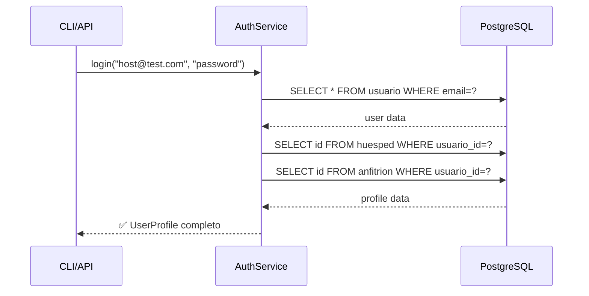

# 🗃️ MAPA COMPLETO DE LLAMADAS A BASES DE DATOS

## 📁 **ESTRUCTURA ORGANIZADA**

```
db/                          # 🏗️ CAPA DE CONEXIÓN
├── postgres.py              # PostgreSQL/Supabase (asyncpg)
├── mongo.py                  # MongoDB Atlas (pymongo)  
├── neo4j.py                  # Neo4j AuraDB (neo4j driver)
├── cassandra.py              # AstraDB/Cassandra
└── redisdb.py               # Redis Cloud

services/                    # 🎯 CAPA DE SERVICIOS (BUSINESS LOGIC)
├── auth.py                  # 🔐 PostgreSQL + Neo4j + MongoDB
├── user.py                  # 👤 PostgreSQL queries
├── neo4j_user.py           # 🕸️  Neo4j operations
├── mongo_host.py           # 🏠 MongoDB operations
├── properties.py           # 🏡 PostgreSQL queries  
├── search.py               # 🔍 Cassandra + Redis cache
├── reservations.py         # 📅 PostgreSQL queries
├── analytics.py            # 📊 Multiple DBs
└── setup.py                # 🛠️  PostgreSQL inserts
```

---

## 🔗 **LLAMADAS POR BASE DE DATOS**

### 🐘 **POSTGRESQL (Supabase)**

#### **Funciones Base** (`db/postgres.py`)
```python
# ⚡ Conexión y Pool
async def get_client() -> asyncpg.Pool
async def close_client()

# 📝 Queries principales
async def execute_query(query: str, *args)      # SELECT, INSERT con RETURNING
async def execute_command(query: str, *args)    # INSERT, UPDATE, DELETE
async def execute_query_one(query: str, *args)  # Single result

# 🛠️  Helpers
async def insert_one(table: str, data: dict)
async def update_by_id(table: str, id: int, data: dict)
async def delete_by_id(table: str, id: int)
async def get_by_id(table: str, id: int)
async def get_all(table: str, limit: int = 100)
async def count_records(table: str, where_clause: str = None)
```

#### **Servicios que usan PostgreSQL:**

**🔐 AuthService** (`services/auth.py`)
```python
# Registro de usuarios
execute_query("INSERT INTO usuario (email, rol) VALUES ($1, $2) RETURNING id, email, rol, auth_user_id, creado_en")
execute_query("SELECT id FROM huesped WHERE usuario_id = $1")
execute_query("SELECT id FROM anfitrion WHERE usuario_id = $1") 

# Login
execute_query("SELECT id, email, rol, creado_en FROM usuario WHERE email = $1")

# Actualización de rol
execute_query("UPDATE usuario SET rol = $1 WHERE id = $2 RETURNING id")
```

**👤 UserService** (`services/user.py`)
```python
# Perfiles de huésped
execute_query("SELECT id, nombre, email, telefono FROM huesped WHERE usuario_id = $1")
execute_query("SELECT COUNT(*) as total_reservas, COUNT(*) FILTER (...) as reservas_activas FROM reserva...")

# Perfiles de anfitrión  
execute_query("SELECT id, nombre, cant_rvas_completadas FROM anfitrion WHERE usuario_id = $1")
execute_query("SELECT COUNT(*) as total_propiedades FROM propiedad WHERE anfitrion_id = $1")

# Reservas y propiedades del usuario
execute_query("SELECT r.*, p.nombre as propiedad_nombre FROM reserva r JOIN propiedad p...")
execute_query("SELECT p.*, c.nombre as ciudad, pa.nombre as pais FROM propiedad p...")
```

**🏡 PropertyService** (`services/properties.py`)
```python
# Gestión de propiedades
execute_query("SELECT id, nombre FROM pais ORDER BY nombre")
execute_query("SELECT id, nombre, cp FROM ciudad WHERE pais_id = $1")
execute_query("INSERT INTO propiedad (...) VALUES (...) RETURNING id")

# Estadísticas
execute_query("SELECT COUNT(*) as total FROM propiedad")
execute_query("SELECT tp.nombre, COUNT(*) as cantidad FROM propiedad p JOIN tipo_propiedad tp...")
```

**🛠️ SetupService** (`services/setup.py`)
```python
# Datos básicos del sistema
execute_command("INSERT INTO pais (nombre) VALUES ($1) ON CONFLICT (nombre) DO NOTHING")
execute_command("INSERT INTO ciudad (nombre, cp, pais_id) VALUES ($1, $2, $3)")
execute_command("INSERT INTO tipo_propiedad (nombre) VALUES ($1)")
# + amenities, servicios, reglas, etc.
```

---

### 🍃 **MONGODB (Atlas)**

#### **Funciones Base** (`db/mongo.py`)
```python
# ⚡ Conexión
@retry_on_connection_error()
def get_client() -> MongoClient
def get_database()
def get_collection(collection_name: str)

# 📄 Document operations
def find_documents(collection_name: str, filter_query: dict = None, limit: int = None)
def insert_document(collection_name: str, document: dict)
```

#### **MongoHostService** (`services/mongo_host.py`)
```python
# 🏠 Documentos de anfitriones
self.collection = get_collection("hosts")

# CRUD Operations
self.collection.insert_one(host_document)               # Crear documento anfitrión
self.collection.find_one({"host_id": host_id})          # Buscar documento
self.collection.update_one({"host_id": host_id}, {...}) # Agregar ratings
self.collection.aggregate(pipeline)                     # Estadísticas y reports

# Estructura del documento:
{
  "host_id": 1,                    # ID del anfitrión (de PostgreSQL)
  "ratings": [                     # Array de calificaciones
    {
      "guest_id": 5,
      "rating": 4.5,
      "comment": "Excelente anfitrión",
      "reservation_id": 123,
      "created_at": "2025-11-15T..."
    }
  ],
  "stats": {                       # Estadísticas calculadas
    "total_ratings": 1,
    "average_rating": 4.5,
    "total_reviews": 1
  },
  "created_at": "2025-11-15T...",
  "updated_at": "2025-11-15T..."
}
```

---

### 🕸️ **NEO4J (AuraDB)**

#### **Funciones Base** (`db/neo4j.py`)
```python
# ⚡ Conexión
async def get_client()              # GraphDatabase.driver
async def close_client()
```

#### **Neo4jUserService** (`services/neo4j_user.py`)
```python
# 👥 Nodos de Usuario
client.execute_query(
    "CREATE (u:Usuario {id: $user_id, rol: $rol}) RETURN u",
    user_id=user_id, rol=rol
)

client.execute_query(
    "MATCH (u:Usuario {id: $user_id}) SET u.rol = $new_role RETURN u",
    user_id=user_id, new_role=new_role
)

client.execute_query(
    "MATCH (u:Usuario {id: $user_id}) RETURN u",
    user_id=user_id
)

# Estructura del nodo:
(:Usuario {id: 19, rol: 'ANFITRION'})
(:Usuario {id: 20, rol: 'HUESPED'}) 
(:Usuario {id: 21, rol: 'AMBOS'})
```

---

### ⚡ **REDIS (Cloud)**

#### **Funciones Base** (`db/redisdb.py`)
```python
# ⚡ Conexión
async def get_client() -> redis.Redis
async def close_client()

# 🗄️ Cache operations  
async def get(key: str)
async def set(key: str, value: str, expire: int = None)
async def delete(key: str)
async def exists(key: str) -> bool
```

#### **Servicios que usan Redis:**
- **SearchService**: Cache de resultados de búsqueda
- **AnalyticsService**: Cache de métricas y reportes

---

### 🌌 **CASSANDRA/ASTRADB**

#### **Funciones Base** (`db/cassandra.py`)
```python
# ⚡ Conexión
def get_session()
def close_session()

# 📊 Queries
def execute_query(query: str, parameters: list = None)
def insert_data(table: str, data: dict)
```

#### **Servicios que usan Cassandra:**
- **SearchService**: Búsquedas geoespaciales y filtros complejos
- **AnalyticsService**: Métricas históricas y big data

---

## 🔄 **FLUJO DE INTEGRACIÓN COMPLETA**

### **Registro de Usuario ANFITRION:**



### **Login de Usuario:**



---

## 🎯 **COMANDOS CLI PARA TESTING**

```bash
# Verificar MongoDB
python -m cli.commands mongo verify
python -m cli.commands mongo hosts

# Verificar Neo4j  
python verify_neo4j_users.py

# Verificar PostgreSQL
python debug_db.py

# Registro completo
python -m cli.commands auth register --email test@example.com --role ANFITRION --name "Test User"

# Test integración completa
python test_simple_mongo.py
```

---

## 📊 **RESUMEN POR SERVICIO**

| Servicio | PostgreSQL | MongoDB | Neo4j | Redis | Cassandra |
|----------|-----------|---------|-------|-------|-----------|
| **AuthService** | ✅ CRUD usuarios | ✅ Host docs | ✅ User nodes | ❌ | ❌ |
| **UserService** | ✅ Profiles | ❌ | ❌ | ❌ | ❌ |
| **Neo4jUserService** | ❌ | ❌ | ✅ Nodes | ❌ | ❌ |
| **MongoHostService** | ❌ | ✅ Ratings | ❌ | ❌ | ❌ |
| **SearchService** | ❌ | ❌ | ❌ | ✅ Cache | ✅ Search |
| **PropertyService** | ✅ Properties | ❌ | ❌ | ❌ | ❌ |
| **AnalyticsService** | ✅ Metrics | ❌ | ✅ Networks | ✅ Cache | ✅ BigData |

Cada servicio está diseñado siguiendo **principios SOLID** con responsabilidades específicas y claras para cada base de datos.